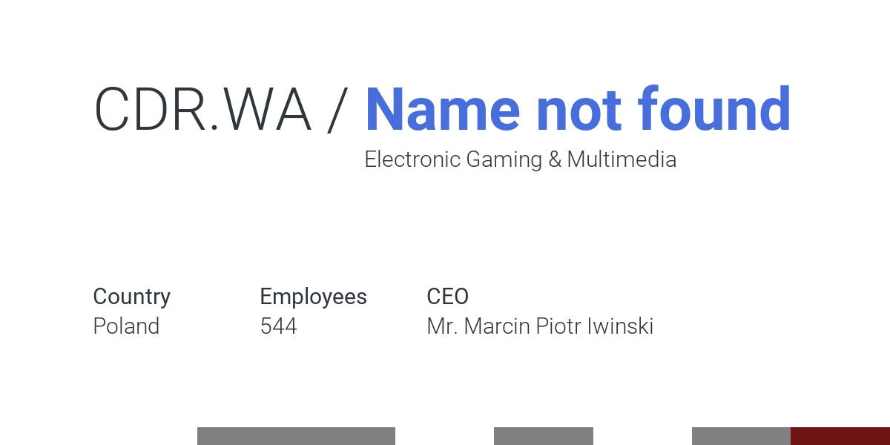
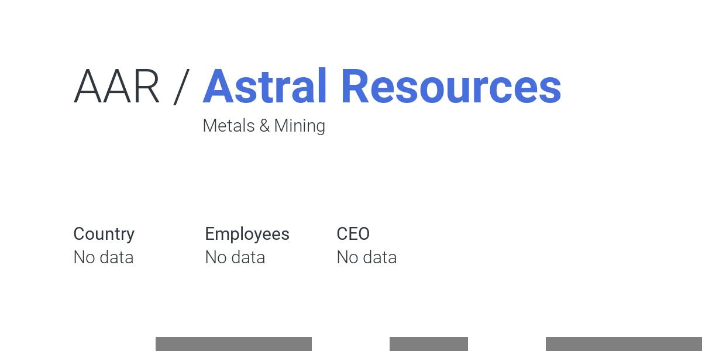
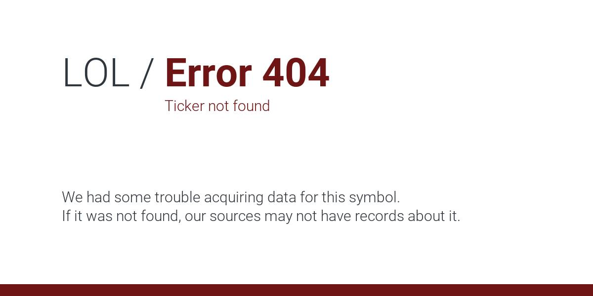

Previews are generated mostly for meta tags, to display on social media.

# Contents

Correct preview contains chosen symbol, name of company with it associated and
its industry.

There is also country, number of employees and current CEO displayed as well.

Most important part is multicolor line visible on the bottom of image.

## Data preview

This line is made from values returned from fetch. It is not fixed, 
and rely on number of `color` values in response 
( Now every value has associated color just after fetching )

It is very easy way to show what to expect about company.

---

# Other versions:

## Some empty values

Every value is optional, in case not every source send data.

## Error

Message is generated based on input, so technically, every error should be
covered